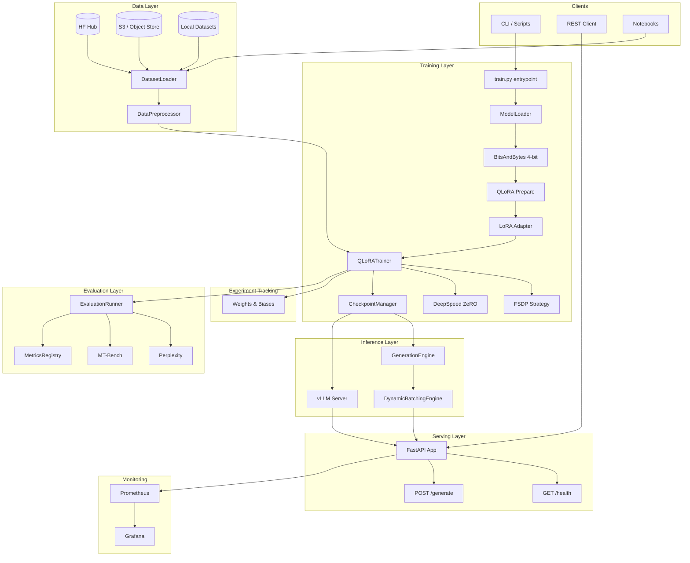
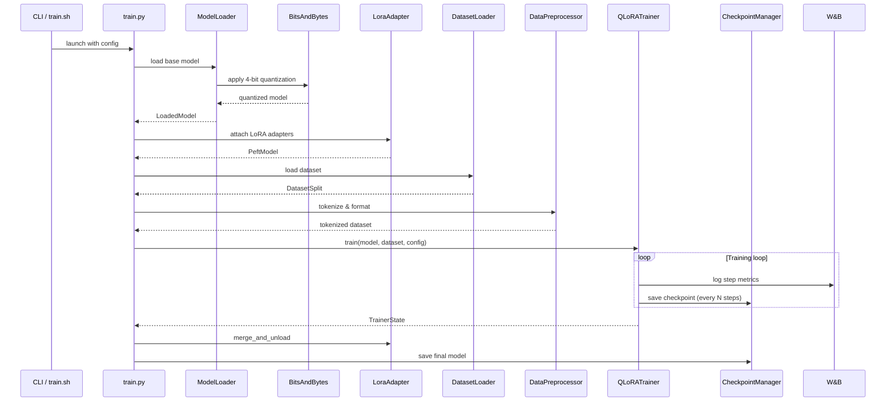
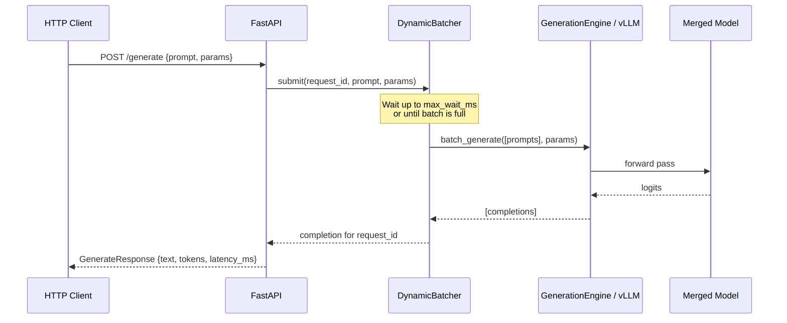
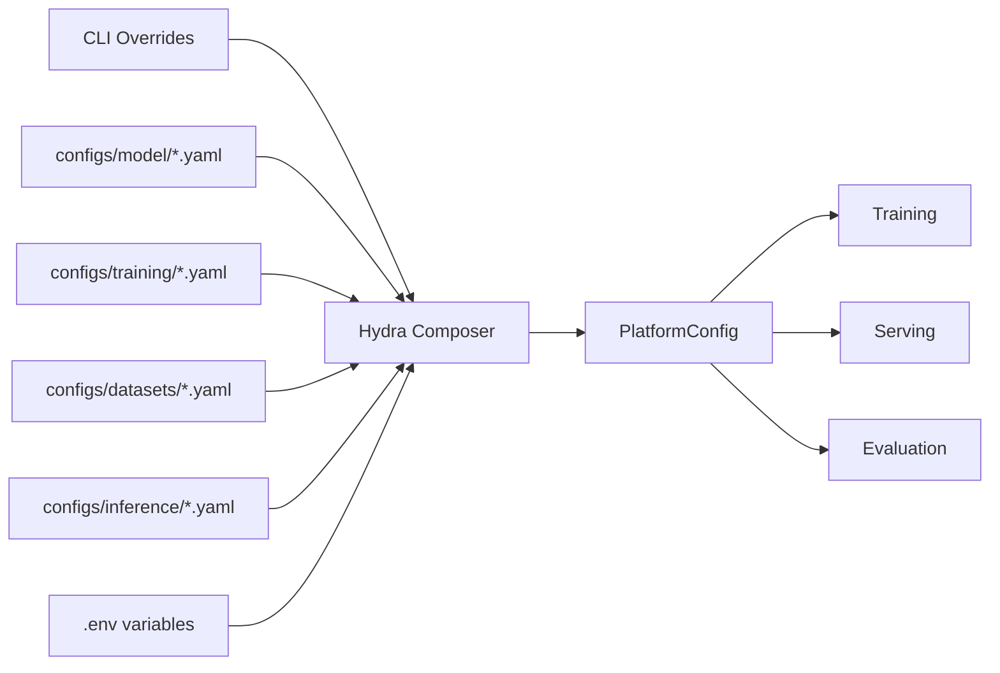
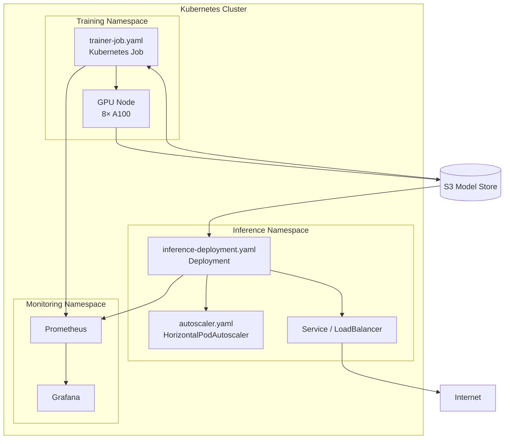

# Architecture

This document describes the high-level system design of the QLoRA Fine-Tuning Platform.

---

## System Overview

---

## Training Pipeline

---

## Inference Pipeline

---

## Component Responsibilities

| Component | Package | Responsibility |
|-----------|---------|----------------|
| `ModelLoader` | `src.models` | Load base model from HF Hub with optional quantization |
| `TokenizerManager` | `src.models` | Load tokenizer, apply prompt templates |
| `LoraAdapter` | `src.models` | Attach and manage PEFT LoRA adapters |
| `DatasetLoader` | `src.data` | Load datasets from HF Hub or local files |
| `DataPreprocessor` | `src.data` | Tokenize and format datasets for training |
| `QLoRATrainer` | `src.training` | Orchestrate the training loop |
| `CheckpointManager` | `src.training` | Save, rotate, and restore checkpoints |
| `GenerationEngine` | `src.inference` | HF-native text generation |
| `VLLMServerManager` | `src.inference` | Manage vLLM subprocess lifecycle |
| `InferenceBenchmark` | `src.inference` | Throughput and latency measurement |
| `EvaluationRunner` | `src.evaluation` | Dispatch evaluation tasks |
| `FastAPI app` | `src.serving` | REST API for inference requests |
| `DynamicBatchingEngine` | `src.serving` | Group concurrent requests into GPU batches |

---

## Configuration Architecture

---

## Deployment Architecture (Kubernetes)

